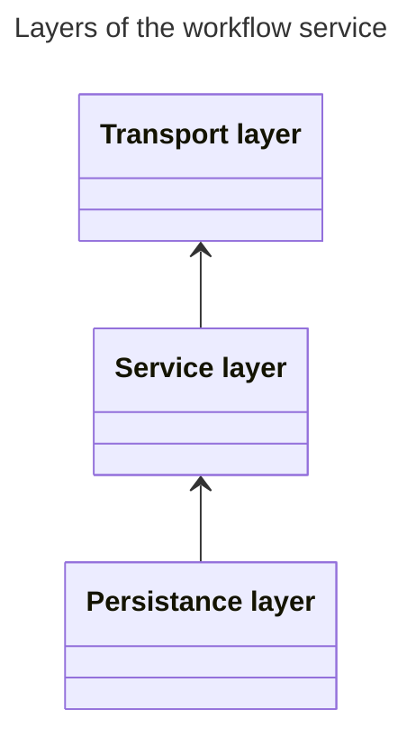

    

# Workflow service
A repository with a service for managing document recognition workflows. This repository is part of Microservice Reference Framework.

## Project structure
- **/cmd** - Folder with app's entry point.
- /config
- /transport
- /service
- /database
- **/.github** - A folder with YAML definitions of GitHub Actions.
- **/repository_assets** - A folder with assets for this repository and not assets for this service.

### Service architecture
This section describes architecture of this particular service and no the entire system. Workflow service uses a layered architecture to separete concerns of handling requests, business logic and persistance (database) layer.

**Note**: Arrows in the diagram below display direction of dependencies between layers. This project utilises Inversion of Control pattern for many component, layers including.

## Deployment process
This section describes the deployment process of this service.

## Getting started

## Used technologies
- go
- Docker
- dapr
- Firebase

### Used patterns
- Repository pattern
- Inversion of Control

### Used libraries
- [go-chi](https://github.com/go-chi/chi "Link to chi GitHub page") - Is a lightweight, idiomatic and composable router for building Go HTTP services.
- go-chi - docgen
- go-chi - jwtauth
- pgx
- sqlx
- Testify
- Viper
- uuid
