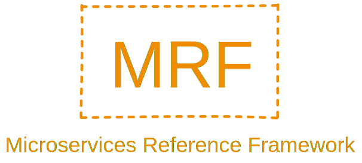
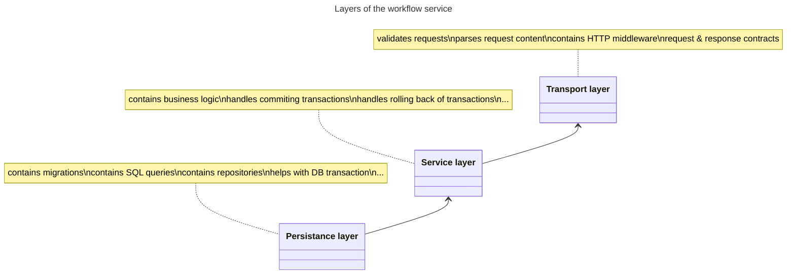
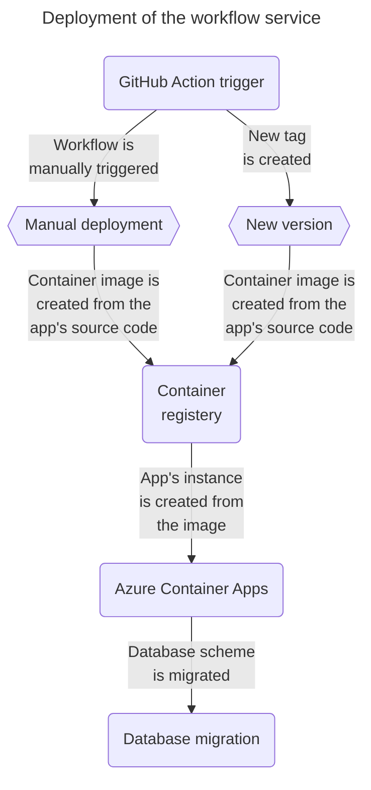

    

# Workflow service
A repository with a service for managing document recognition workflows. This repository is part of [Microservice Reference Framework](https://github.com/MichalMoudry/microservice-reference-framework "Go to Microservice Reference Framework GitHub page").

## Project structure
- **/src** - A folder with all the source code for the workflow service.
    - **/cmd** - Folder with app's entry point.
    - **/config** - Package with service configuration code. That includes functions for reading environment variables and config files.
    - **/transport** - Package with a source code for a transport layer of this service. This packages contains things like request validation, HTTP handler and more.
    - /service
    - **/database** - Folder/package containing database layer of this service. This layer can be responsible for things like handling database queries, starting and commiting transactions.
    - **/test** - Folder containing additional tests outside of unit tests that are part of the main package.
        - /api - A folder containing .http files that are used to test workflow service's API.
- **/.github** - A folder with YAML definitions of GitHub Actions.
- **/assets** - A folder with assets for this repository and not assets for this service.

### Service architecture
This section describes architecture of this particular service and no the entire system. Workflow service uses a layered architecture to separete concerns of handling requests, business logic and persistance (database) layer.

**Note**: Arrows in the diagram below display direction of dependencies between layers. This project utilises Inversion of Control pattern for many component, layers including.

**Diagram catalog**:
- Transport layer
- Service layer
- Persistance layer

## Deployment
This section contains information about workflow service's deployment process and environment.
### Deployment process
This sub-section describes the deployment process of this service.

**Diagram catalog**:
- **GitHub Action trigger** - Starting point of the deployment process is a GitHub action for deploying the workflow service. This action is triggered manually or when a new version/tag is created.
- **Manual deployment** - An event that represents a manual deployment of the workflow service.
- **New version** - An event representing an automatic deployment of the workflow service. This event is triggered when a new version/tag has been created.
- **Container registry** - A registry for storing container images.
    - Examples: Docker hub or Azure Container Registry.
- **Azure Container Apps** - A cloud environment where this service is being hosted/deployed. This environment has Dapr as a serverless service.
- **Database migration** - There is a mechanism for migrating database scheme to a new version. This service uses so called `init container` to migrate the database.

### Deployment diagram

## Getting started
### Running locally
### Running service as a container

## Used technologies
- go
- Docker
- dapr
- PostgreSQL

### Used patterns
- Repository pattern
- Inversion of Control

### Used libraries
- [go-chi](https://github.com/go-chi/chi "Link to chi's GitHub page") - Is a lightweight, idiomatic and composable router for building Go HTTP services.
- [pgx](https://github.com/jackc/pgx "Link to pgx's GitHub page") - It is a driver and a toolkit for PostgreSQL.
- [sqlx](https://github.com/jmoiron/sqlx "Link to sqlx's GitHub page") - It is a library which provides a set of extensions on go's standard database/sql library.
- [Testify](https://github.com/stretchr/testify "Link to Testify's GitHub page") - It is a toolkit with common assertions and mocks.
- [Viper](https://github.com/spf13/viper "Link to Viper's GitHub page") - Viper is a package for dealing with app's configuration.
- [uuid](https://github.com/google/uuid "Link to uuid's GitHub page") - Package for generating and inspecting UUIDs.
