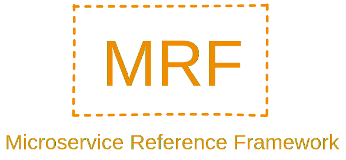
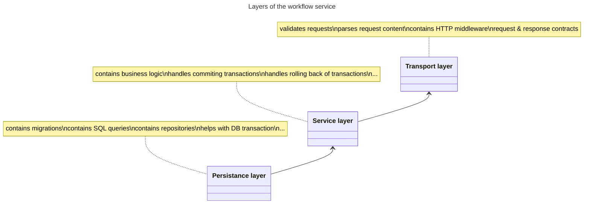

    

# Workflow service
A repository with a service for managing document recognition workflows. This repository is part of [Microservice Reference Framework](https://github.com/MichalMoudry/microservice-reference-framework "Go to Microservice Reference Framework GitHub page").

## Project structure
- **/src** - A folder with all the source code for the workflow service.
    - **/cmd** - Folder with app's entry point.
    - **/config** - Package with service configuration code. That includes functions for reading environment variables and config files.
    - **/transport** - Package with a source code for a transport layer of this service. This packages contains things like request validation, HTTP handler and more.
    - /service
    - /database
    - **/test** - Folder containing additional tests outside of unit tests that are part of the main package.
        - /api - A folder containing .http files that are used to test workflow service's API.
- **/.github** - A folder with YAML definitions of GitHub Actions.
- **/repository_assets** - A folder with assets for this repository and not assets for this service.

### Service architecture
This section describes architecture of this particular service and no the entire system. Workflow service uses a layered architecture to separete concerns of handling requests, business logic and persistance (database) layer.

**Note**: Arrows in the diagram below display direction of dependencies between layers. This project utilises Inversion of Control pattern for many component, layers including.

**Diagram catalog**:
- Transport layer
- Service layer
- Persistance layer

## Deployment process
This section describes the deployment process of this service.

## Getting started

## Used technologies
- go
- Docker
- dapr
- PostgreSQL

### Used patterns
- Repository pattern
- Inversion of Control

### Used libraries
- [go-chi](https://github.com/go-chi/chi "Link to chi GitHub page") - Is a lightweight, idiomatic and composable router for building Go HTTP services.
- go-chi - jwtauth
- pgx
- sqlx
- Testify
- Viper
- uuid
